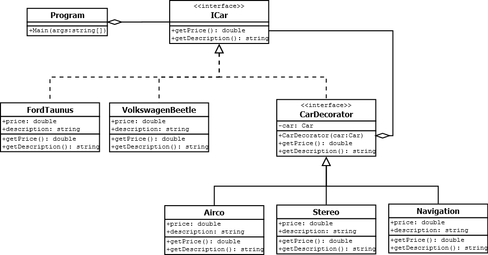

UML designs TSE6-DP
================================================================================================================
## Assignment 1: Strategy  
  
  
## Assignment 2: Observer
  
  
## Assignment 3: Abstract Factory  
  
  
## Assignment 4: Decorator  
  

## Assignment 5: --
todo  